# RESBOX - Frontend Documentation

## Introduction

### Project Name
**Resbox**
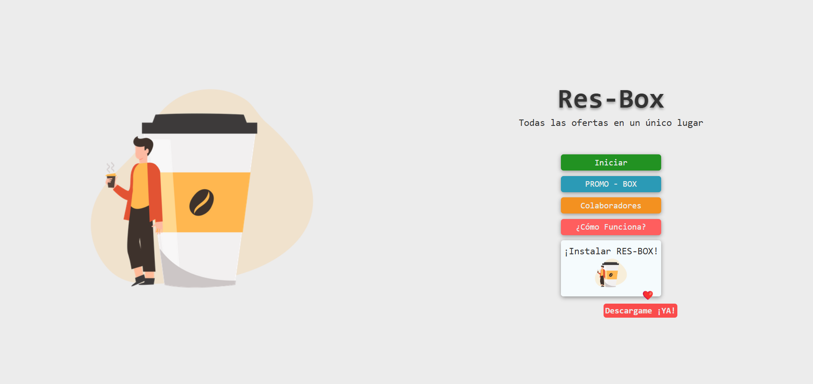

### Objective

## About Resbox

**Resbox** is an innovative web application developed as the final project for the Rock The Code bootcamp. 🎓 This application is designed to fulfill a specific need in the restaurant industry, providing valuable tools for both restaurant owners and their consumer clients. 

### Why Resbox?

With a deep passion for the restaurant sector, Resbox aims to streamline operations and enhance customer engagement through user-friendly features. Whether it’s managing reservations, analyzing customer data, or improving communication, Resbox is here to transform the dining experience for all stakeholders involved.

### Key Features

- **Streamlined Processes**: Simplifies restaurant management tasks.
- **Enhanced Customer Engagement**: Facilitates better interaction between restaurants and consumers.
- **Data-Driven Insights**: Empowers restaurants with analytics to improve service and satisfaction.

Join us in revolutionizing the restaurant experience with **Resbox**!

## Main Technologies

| Technology                     | Description                                                             |
| ------------------------------ | ----------------------------------------------------------------------- |
| **React**                      | Library for building the user interface.                               |
| **Vite**                       | Module bundler and development server for fast builds.                 |
| **ESLint**                     | Linting tool to maintain code quality.                                 |
| **Chart.js & react-chartjs-2**| For creating interactive charts and data visualizations.               |
| **Leaflet & react-leaflet**   | For integrating maps and geolocation.                                  |
| **date-fns**                  | Library for handling dates and times.                                  |
| **jsPDF & jsPDF-autotable**   | For generating downloadable PDF reports.                               |
| **react-hook-form**           | For managing forms and validation.                                     |
| **@react-oauth/google**       | OAuth integration with Google for secure user authentication.          |

### Dependencies

| Dependency                    | Version       | Description                                        |
| ------------------------------ | ------------- | -------------------------------------------------- |
| **@react-oauth/google**       | ^0.12.1      | OAuth integration with Google.                     |
| **canvas-confetti**           | ^1.9.3       | Library for adding confetti animations.            |
| **chart.js**                  | ^4.4.4       | Library for creating interactive charts.           |
| **date-fns**                  | ^4.1.0       | Utility library for managing dates and times.     |
| **jspdf**                     | ^2.5.2       | Library for generating PDF documents.              |
| **jspdf-autotable**           | ^3.8.3       | Plugin for jsPDF to create tables in PDFs.        |
| **leaflet**                   | ^1.9.4       | Library for interactive maps.                       |
| **react**                     | ^18.3.1      | Library for building the user interface.          |
| **react-chartjs-2**          | ^5.2.0       | Wrapper for Chart.js in React applications.        |
| **react-dom**                 | ^18.3.1      | Entry point for React DOM rendering.               |
| **react-hook-form**           | ^7.53.0      | Library for form management and validation.        |
| **react-leaflet**             | ^4.2.1       | React wrapper for Leaflet.                          |
| **react-router-dom**          | ^6.26.2      | Declarative routing for React applications.        |

### DevDependencies

| DevDependency                 | Version       | Description                                        |
| ------------------------------ | ------------- | -------------------------------------------------- |
| **@eslint/js**                | ^9.9.0       | ESLint core library for JavaScript linting.       |
| **@types/react**              | ^18.3.3      | TypeScript definitions for React.                 |
| **@types/react-dom**          | ^18.3.0      | TypeScript definitions for React DOM.             |
| **@vitejs/plugin-react**      | ^4.3.1       | Vite plugin for React integration.                 |
| **eslint**                    | ^9.9.0       | Linting utility for JavaScript and JSX.           |
| **eslint-plugin-react**       | ^7.35.0      | ESLint rules for React applications.               |
| **eslint-plugin-react-hooks** | ^5.1.0-rc.0  | ESLint rules for React hooks.                      |
| **eslint-plugin-react-refresh**| ^0.4.9      | ESLint plugin for React Fast Refresh.              |
| **globals**                   | ^15.9.0      | Provides global variables for linting.             |
| **vite**                      | ^5.4.1       | Next Generation Frontend Tooling.                  |

## Installation and Setup

### Prerequisites

Before setting up the project, make sure you have the following software installed:

| Software       | Description                                         |
| -------------- | --------------------------------------------------- |
| **Node.js**    | Recommended version: 20.x or higher.               |
| **npm**        | Comes with Node.js, used for managing packages.    |


### Cloning the Repository

To get started, clone the project repository from GitHub:

```bash
git clone https://github.com/danielemazzola/res-box_v2.git
```

## Repository Overview

This repository contains both the backend and frontend code for **Resbox**. Each environment has its own documentation within the respective folders. For the frontend documentation, refer to the `Resbox-frontend` folder, which includes all files and instructions specific to the frontend setup.

## Execution and Scripts

### Available Scripts

The `package.json` file includes several scripts to streamline development, build, and linting processes. Here’s a breakdown of each available script:

- **dev**: Starts the development server using Vite.

```bash
  npm run dev
```

Use this script during development to run a local server with hot-reloading, allowing you to see changes immediately.

build: Builds the project for production.

```bash
npm run build
```

This command compiles the application into a production-ready bundle, optimized for performance, and outputs it to the dist folder.

lint: Runs ESLint to check for code quality and potential issues.

```bash
npm run lint
```

This script uses the ESLint configuration in eslint.config.js to enforce coding standards and best practices, helping maintain consistent code quality.

preview: Starts a local server to preview the production build.

```bash
npm run preview
```

### ESLint Configuration

The ESLint configuration, located in `eslint.config.js`, defines essential settings and rules for maintaining code quality in the Resbox project. Below is a detailed overview of its components:

#### Plugins
The following plugins are included to enhance linting capabilities:

- **react**: 
  - Provides linting rules specific to React best practices.
  
- **react-hooks**: 
  - Ensures correct usage of React hooks to avoid common pitfalls.
  
- **react-refresh**: 
  - Manages component refresh behavior, which is crucial for consistent hot-reloading during development.

#### Rules
Several custom rules have been defined to tailor ESLint to the project's needs:

- **`'react/jsx-no-target-blank': 'off'`**: 
  - Disables warnings for links opening in new tabs without `rel="noopener noreferrer"`.
  
- **`'react-refresh/only-export-components': ['warn', { allowConstantExport: false }]`**: 
  - Issues a warning if non-components are exported while using React Fast Refresh.
  
- **`'react/prop-types': 'off'`**: 
  - Disables the requirement for `prop-types` in component props.
  
- **`'react/jsx-one-expression-per-line': 'off'`**: 
  - Allows multiple expressions per line in JSX for improved flexibility.
  
- **`'max-len': ['off']`**: 
  - Disables the maximum line length rule, providing more freedom in code formatting.

#### Environment Settings
The ESLint configuration also specifies the environment settings:

- **ECMAScript Version**: Set to **2020** for compatibility with modern JavaScript features.
- **JSX Support**: Enabled to accommodate React's JSX syntax, ensuring smooth integration with React 18.

This structured approach to ESLint ensures that the project adheres to best practices while allowing flexibility where necessary.

## Project Structure

The Resbox frontend project is organized into a structured directory layout, which helps in maintaining and navigating the codebase efficiently. Below is an overview of the main directories and their purpose:

### Root Directory
**Resbox-frontend**

### Directories
```
├───assets
├───components
│   ├───alert
│   ├───auth-google
│   ├───bar-nav-footer-auth
│   ├───box-card
│   ├───button-top-scroll
│   ├───card-comment
│   ├───cart
│   ├───footer
│   ├───form-group
│   ├───header
│   ├───home
│   │   ├───how-it-works
│   │   └───information-app
│   ├───install-app
│   ├───like
│   ├───loader
│   ├───modal
│   ├───modal-user-partner
│   ├───nav-bar
│   ├───operation-card
│   ├───partner
│   ├───partner-card
│   ├───profile-card
│   ├───promo-box-card
│   ├───protected-route
│   └───toast-notification
├───context
│   ├───auth
│   ├───reducers
│   └───scroll-ref
├───helpers
├───hooks
├───layout
├───pages
│   ├───404
│   ├───Home
│   ├───isAuth
│   │   ├───cart-items
│   │   ├───comments
│   │   ├───dashboard
│   │   ├───invoice
│   │   ├───my-box
│   │   ├───operations
│   │   ├───partner
│   ├───auth
│   ├───reducers
│   └───scroll-ref
├───helpers
├───hooks
├───layout
├───pages
│   ├───404
│   ├───Home
│   ├───isAuth
│   │   ├───cart-items
│   │   ├───comments
│   │   ├───dashboard
│   │   ├───invoice
│   │   ├───my-box
│   │   ├───operations
│   │   ├───partner
├───hooks
├───layout
├───pages
│   ├───404
│   ├───Home
│   ├───isAuth
│   │   ├───cart-items
│   │   ├───comments
│   │   ├───dashboard
│   │   ├───invoice
│   │   ├───my-box
│   │   ├───operations
│   │   ├───partner
│   ├───404
│   ├───Home
│   ├───isAuth
│   │   ├───cart-items
│   │   ├───comments
│   │   ├───dashboard
│   │   ├───invoice
│   │   ├───my-box
│   │   ├───operations
│   │   ├───partner
│   │   ├───comments
│   │   ├───dashboard
│   │   ├───invoice
│   │   ├───my-box
│   │   ├───operations
│   │   ├───partner
│   │   └───promo-box
│   │   ├───invoice
│   │   ├───my-box
│   │   ├───operations
│   │   ├───partner
│   │   └───promo-box
│   └───Recovery-password
├───reducer
│   │   ├───operations
│   │   ├───partner
│   │   └───promo-box
│   └───Recovery-password
├───reducer
│   ├───auth-reducer
│   │   └───promo-box
│   └───Recovery-password
├───reducer
│   ├───auth-reducer
│   └───Recovery-password
├───reducer
│   ├───auth-reducer
│   ├───comment.reducer
│   ├───invoice-reducer
│   ├───loader-reducer
│   ├───auth-reducer
│   ├───comment.reducer
│   ├───invoice-reducer
│   ├───loader-reducer
│   ├───comment.reducer
│   ├───invoice-reducer
│   ├───loader-reducer
│   ├───partner-reducer
│   ├───partner-reducer
│   ├───promo-box
│   ├───promo-box
│   └───toast-notification-reducer
│   └───toast-notification-reducer
└───services
    ├───fetch-auth
    ├───fetch-comment
    ├───fetch-like
    ├───fetch-operation
    └───fetch-partner
```
## Using External APIs and Libraries

### Google OAuth Integration

- **To integrate Google OAuth, start by installing the necessary library. Wrap your application in the `GoogleOAuthProvider` component. In this project, the setup is done in the `main.js` file as follows:**

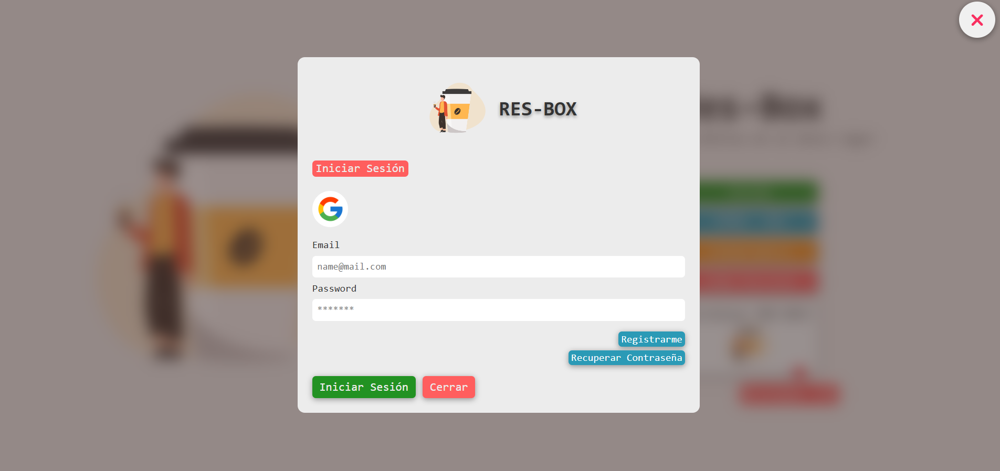

```javascript
import { createRoot } from 'react-dom/client';
import { StrictMode } from 'react';
import { BrowserRouter } from 'react-router-dom';
import { GoogleOAuthProvider } from '@react-oauth/google';
import { ReducersProvider, ScrollRefProvider, AuthProvider } from './context';
import App from './App';

createRoot(document.getElementById('root')).render(
  <StrictMode>
    <BrowserRouter>
      <GoogleOAuthProvider clientId={import.meta.env.VITE_ID_CLIENT_GOOGLE}>
        <ReducersProvider>
          <ScrollRefProvider>
            <AuthProvider>
              <App />
            </AuthProvider>
          </ScrollRefProvider>
        </ReducersProvider>
      </GoogleOAuthProvider>
    </BrowserRouter>
  </StrictMode>
);

```

### Authentication Logic
All the logic for handling Google authentication is managed in the AuthGoogle.jsx component. Below are the most relevant parts of the implementation:
```javascript
const AuthGoogle = ({ handleCloseModal }) => {

  const handleLoginSuccess = async (credentialResponse) => {
    try {
      dispatchLoader({ type: 'SET_LOAD_TRUE' });
      const response = await fetch(`${import.meta.env.VITE_URL_API}/${API_URL.login_google}`, {
        method: 'POST',
        headers: {
          'Content-Type': 'application/json',
        },
        body: JSON.stringify({ id_token: credentialResponse }),
      });
      const data = await response.json();
      if (response.status !== 200) {
        dispatchToast({
          type: 'ADD_NOTIFICATION',
          payload: { msg: `Error: ${data.message}`, error: true },
        });
      } else {
        dispatchToast({
          type: 'ADD_NOTIFICATION',
          payload: { msg: `Welcome ${data.user.name}`, error: false },
        });
        dispatchAuth({ type: 'SET_USER', payload: data.user });
        dispatchAuth({ type: 'SET_AUTH_TRUE' });
        localStorage.setItem('SECURE_CODE_RESBOX', data.token);
        setToken(localStorage.getItem('SECURE_CODE_RESBOX'));
        setTimeout(() => {
          navigate('./dashboard');
        }, 500);
      }
      setTimeout(() => {
        handleCloseModal();
      }, 500);
    } catch (error) {
      dispatchToast({
        type: 'ADD_NOTIFICATION',
        payload: { msg: error.message, error: true },
      });
    } finally {
      setTimeout(() => {
        dispatchLoader({ type: 'SET_LOAD_FALSE' });
      }, 1500);
    }
  };
};

export default AuthGoogle;
```
- **This implementation includes handling the login process and managing user authentication states. The useGoogleLogin hook is used to initiate the login process, and the successful login is processed in the handleLoginSuccess function, where user information is stored, and a notification is dispatched.**


## Environment Variables

| Variable          | Description                                                |
| ------------------| ---------------------------------------------------------- |
| **VITE_URL_API**  | The API endpoint for secure access to backend services.    |
| **VITE_URL_PUBLIC**| The public URL for accessing the Resbox frontend application.|


## THINGS TO DO 

| Feature                      | Description                                                                                          |
|------------------------------|------------------------------------------------------------------------------------------------------|
| **Form Handling**            | Brief description of how `react-hook-form` is integrated to manage forms and validations.           |
| **Maps and Geolocation**     | Explanation of how `leaflet` and `react-leaflet` are integrated for map functionality.             |
| **Document and Chart Generation** | Explanation of `chart.js`, `react-chartjs-2`, `jspdf`, and `jspdf-autotable` for creating charts and PDF documents. |
| **Date Handling**            | Description of `date-fns` for manipulating dates and times in the project.                         |
| **Maintenance and Best Practices** | Tips for code maintenance, using `ESLint`, and best practices for consistent code quality.   |

## IMAGES

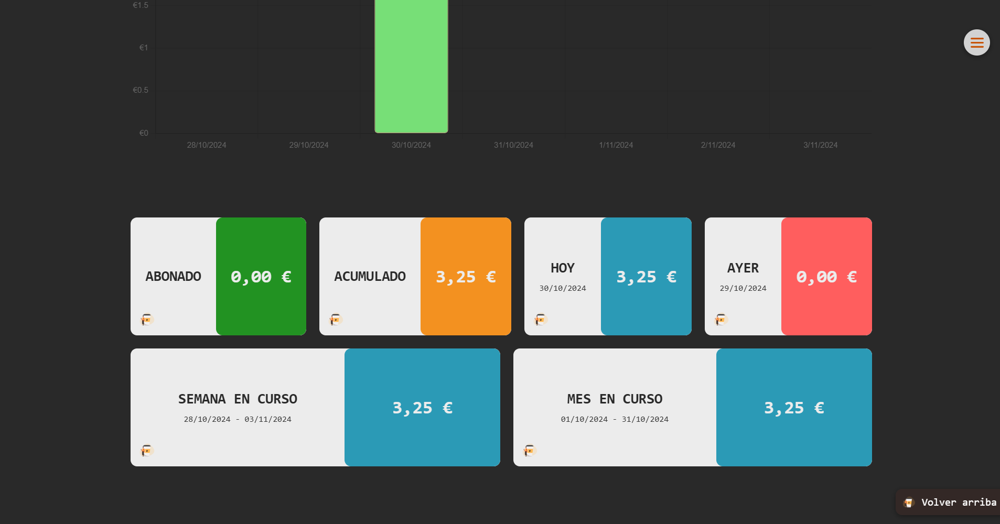
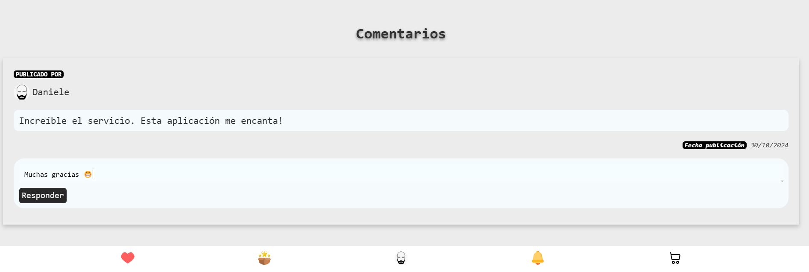
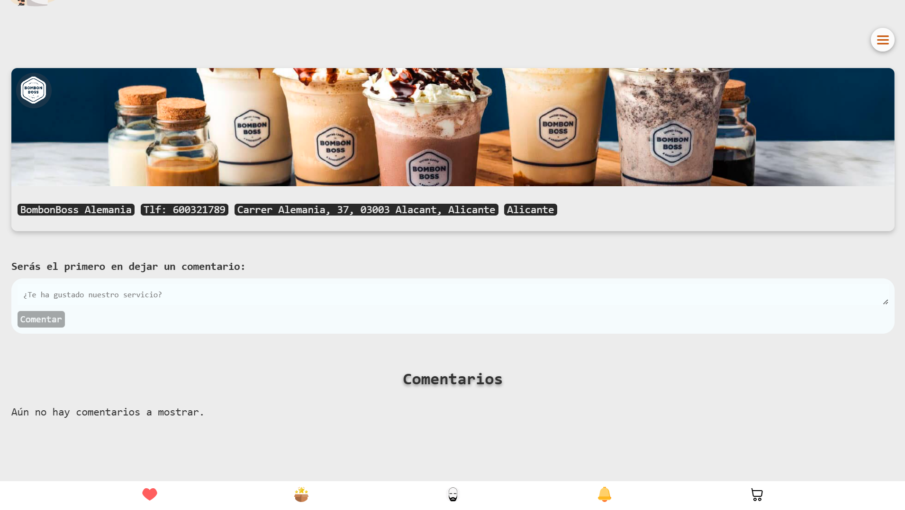
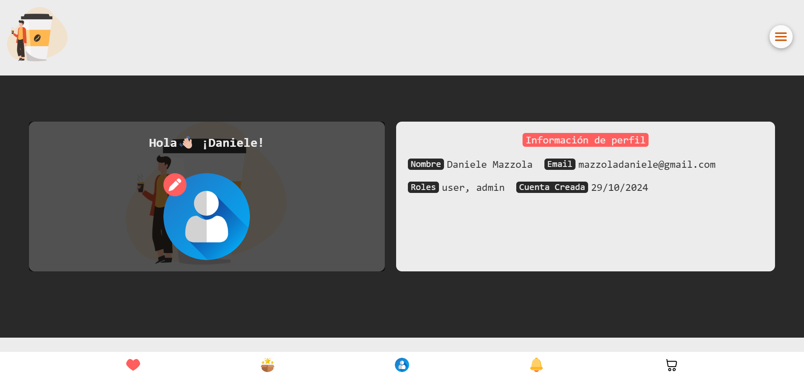
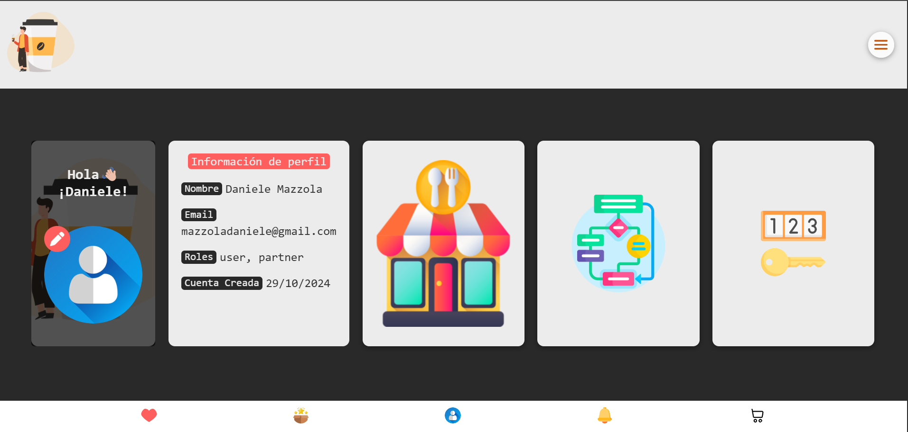
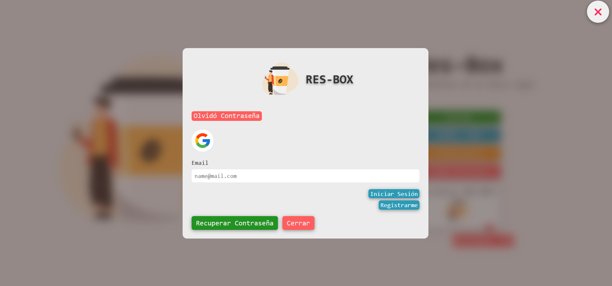

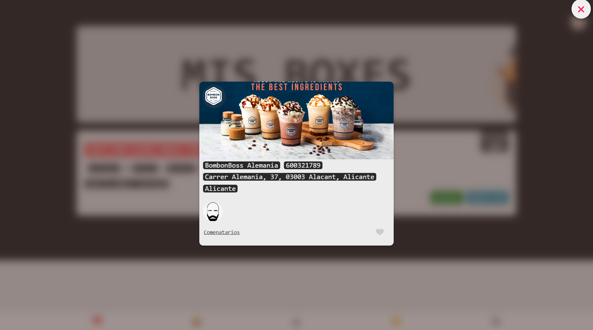
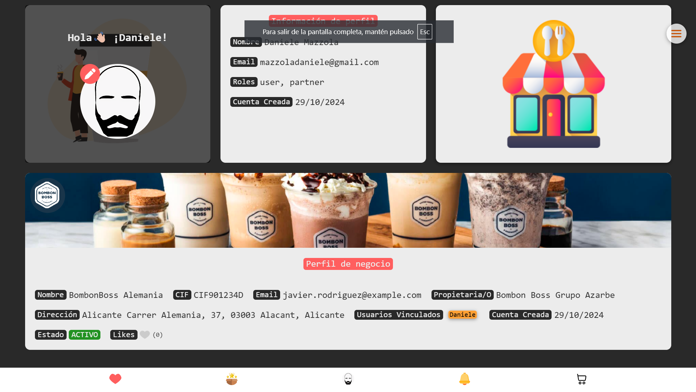
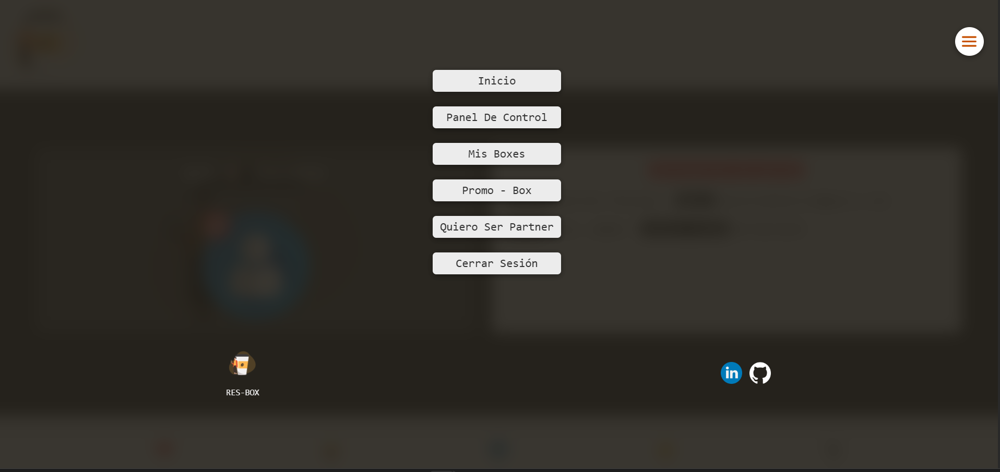

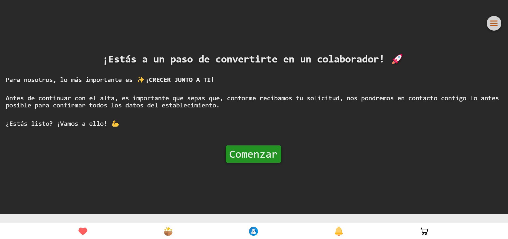
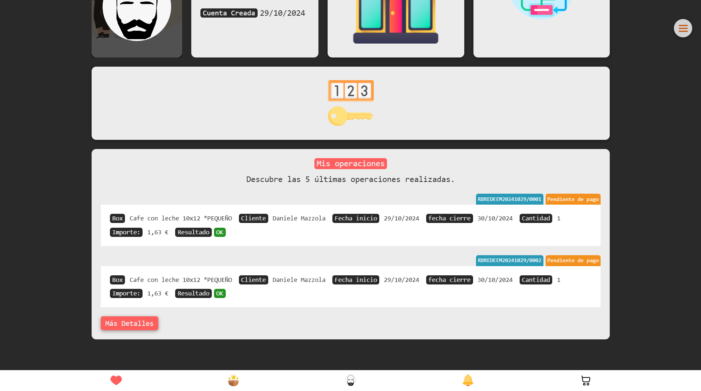
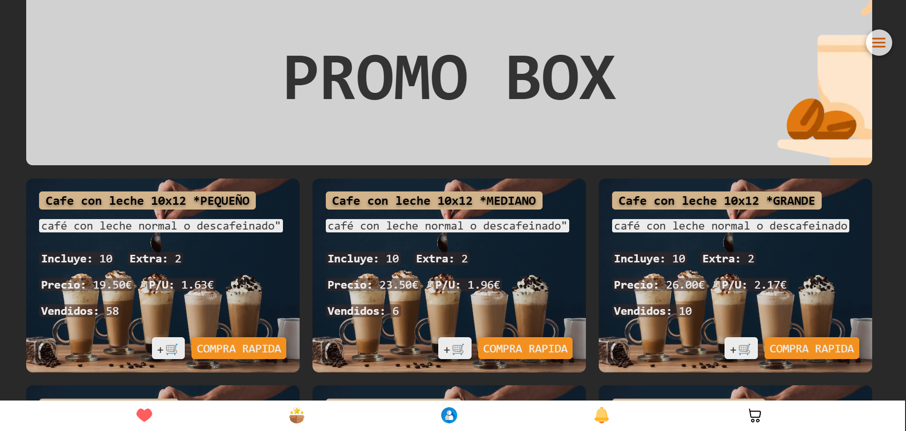
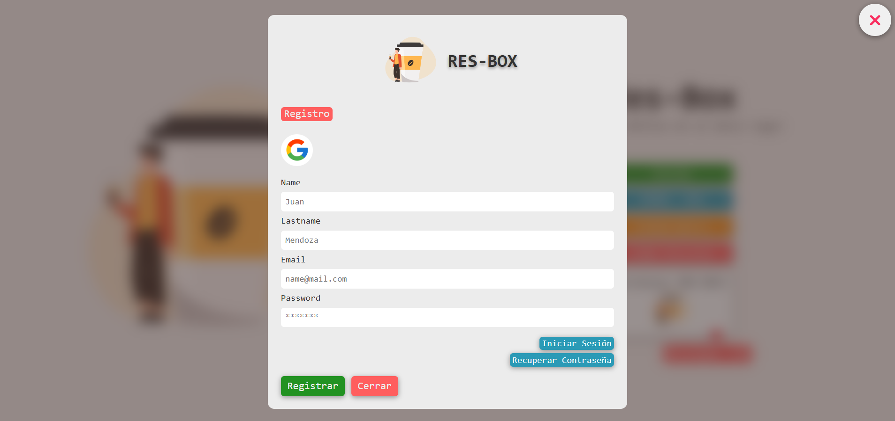
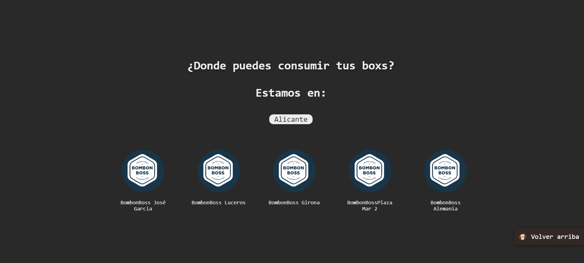